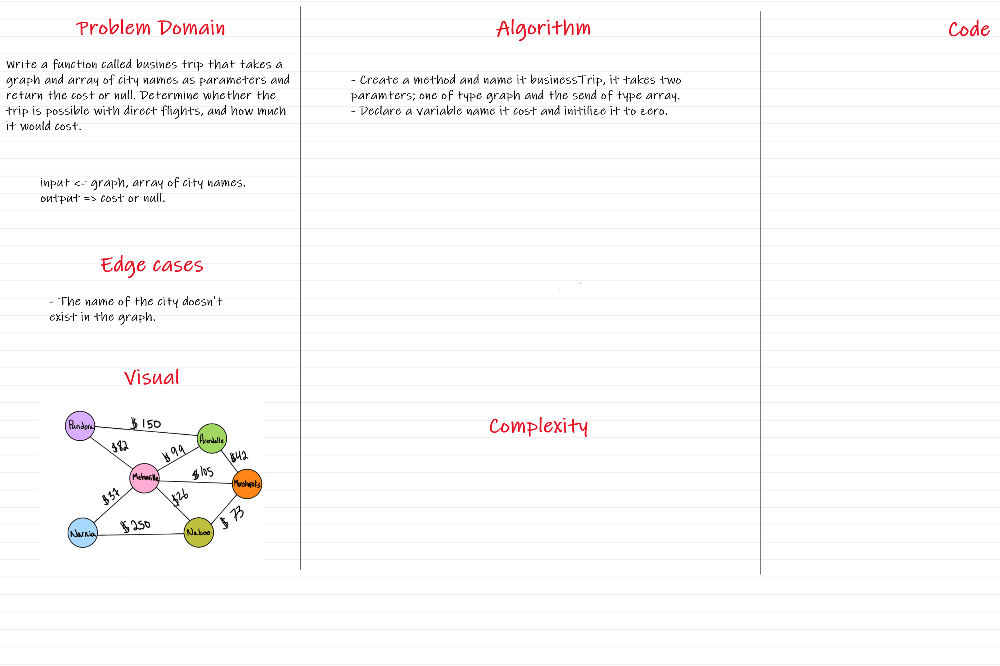
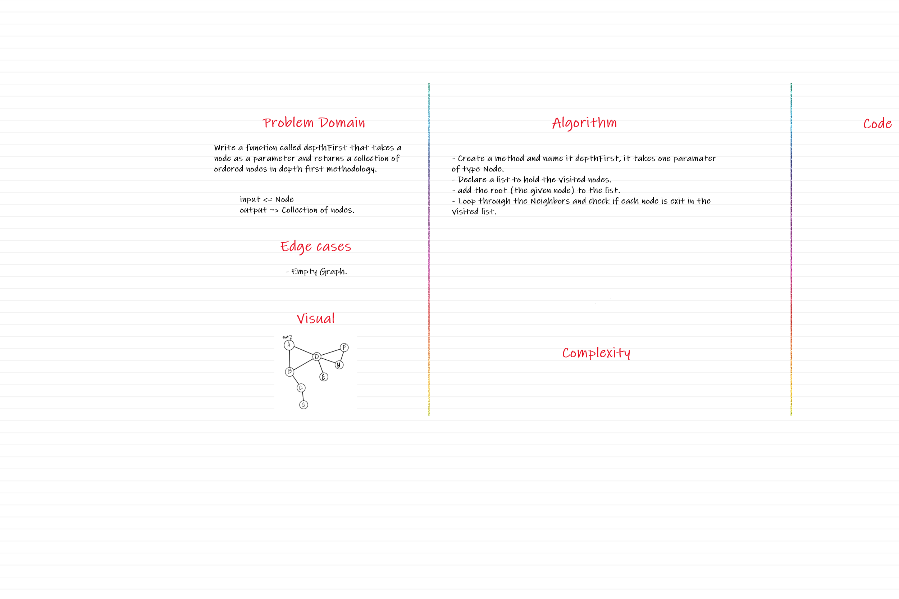

# Graphs

A graph is a non-linear data structure that can be looked at as a collection of `vertices` (or `nodes`) potentially connected by line segments named `edges`.

## Challenge

Implement the graph with specific methods : 

  - addNode() 

  - addEdge()

  - getNodes()

  - getNeighbors()

  - size()

## Approach & Efficiency

  - addNode() 

    * Time : O(1) 

    * Space : O(1)

  - addEdge()

    * Time : O(1) 

    * Space : O(1)

  - getNodes()

    * Time : O(1) 

    * Space : O(1)

  - getNeighbors()

    * Time : O(1) 

    * Space : O(n)

  - size()

    * Time : O(1) 

    * Space : O(1)

## API

- addNode() => To add nodes to the graph.

- addEdge() => Add edges to connect the nodes.

- getNodes() => Get a list of nodes after travsering the graph.

- getNeighbors() => Get the neighbors of each node without duplicates.

- size() => Returns the size of the graph based on the number of nodes.

# Business Trip 

# Depth First 

