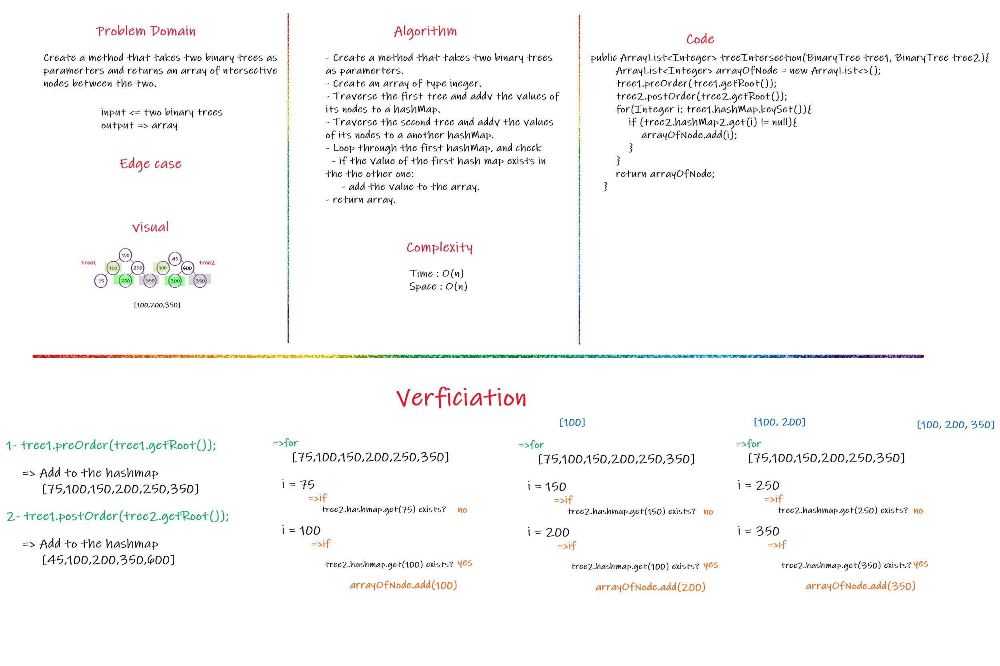
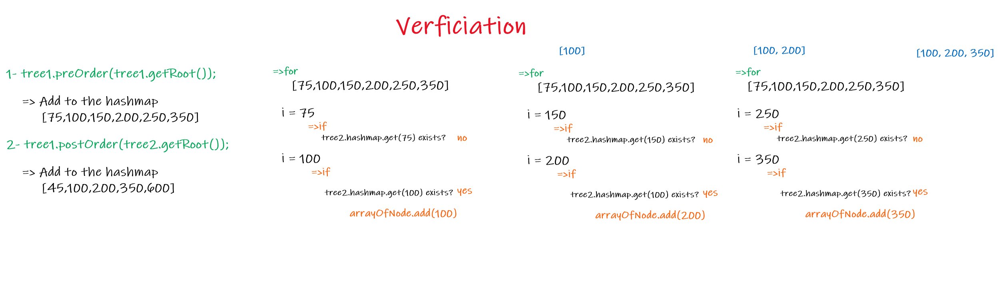

 # Challenge Summary

- Having two binary trees and the requirement is to get the intersective nodes between the two and add it to an array. 

## Whiteboard Process

## Approach & Efficiency

- Time : O(n) => Because we loop through the hashMap in order to ass to the array. 

- Space : O(n) => Because the array takes the space based on its size, and in this case the size of the arraylist in equal to n. 

## Solution

