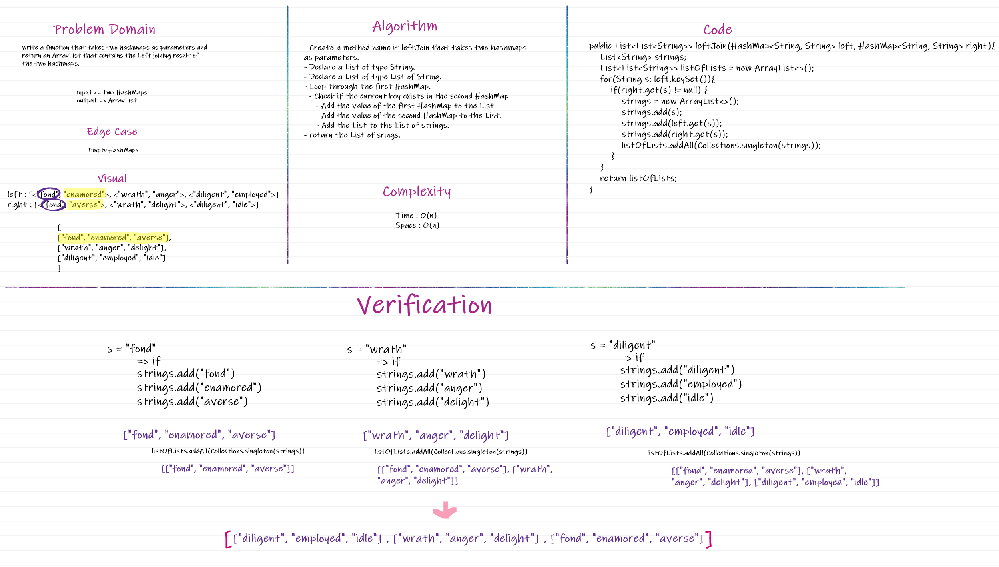
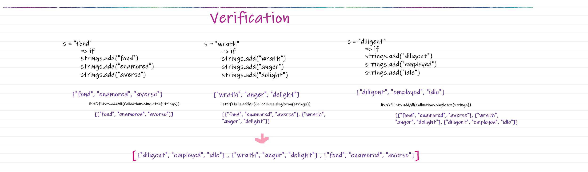

 # Challenge Summary

- Having two binary trees and the requirement is to get the intersective nodes between the two and add it to an array. 

## Whiteboard Process

## Approach & Efficiency

- Time : O(n) => Because we loop through the hashMap in order to add to the array. 

- Space : O(n) => Because the array takes the space based on its size, and in this case the size of the arraylist in equal to n. 

## Solution

 
 

 
 

# Hashmap LEFT JOIN

## Challenge

Write a function that takes two hashmaps as parameters and return an ArrayList that contains the Left joining result of the two hashmaps.

## Whiteboard Process

## Approach & Efficiency

- Time : O(n) => Because we loop through the hashMap in order to check the second hashmap and add to the List of strings. 

- Space : O(n) => Because we create an arrayList to hold the key: value from both hashmaps, and another arrayList to hold the arrayLists which takes the space based on its size, and in this case the size of the arraylist in equal to n. 

## Solution

