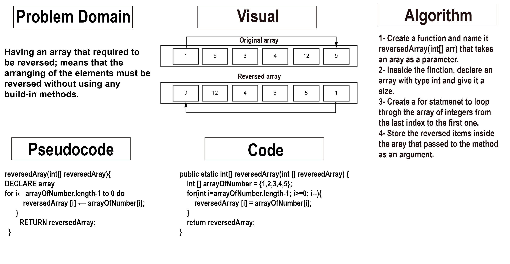

# Reverse an Array

 

Having an array that required to be reversed; means that the arranging of the elements must be reversed without using any build-in methods.

 

## Whiteboard Process

 

 

## Approach & Efficiency

 

I went through the solution step-by-step as the whiteboard shows, starting with understanding the problem domain and visual it, then I write those steps down then converted them into pseudocode then a Java code.  