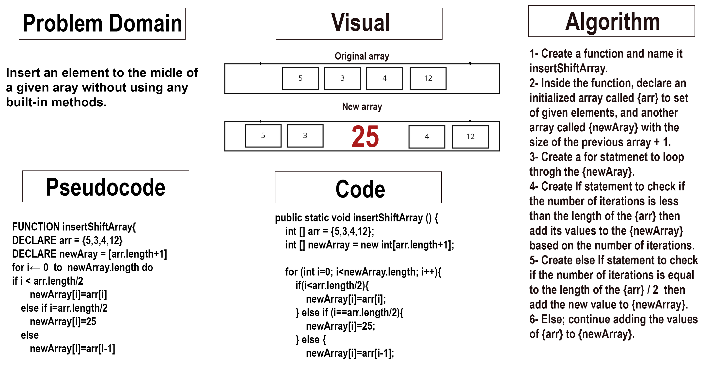

# Add Element To The Middle Of An Array

 

Insert an element to the midle of a given aray without using any built-in methods.
 

## Whiteboard Process

 

 

## Approach & Efficiency

 

I went through the solution step-by-step as the whiteboard shows, starting with understanding the problem domain and visual it, then I write those steps down then converted them into pseudocode then a Java code.  