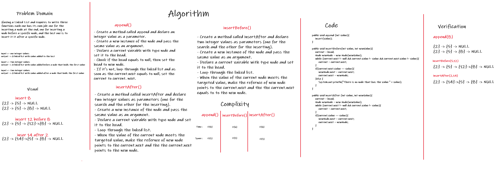

# Singly Linked List

It is a type of data structure that represented by chain of nodes, each node contains a value and a reference to the next node.

## Challenge

The requirements of the challenge : 

- Create a LinkedList. 
  
  1) Create a Node class. 

  2) Create a LinkedList class. 

- Methods => 

  1) Insert values to the LinkedList.

  2) Check If the value exists in the LinkedList or not.

  3) Print out the values of nodes following this format `"{ a } -> { b } -> { c } -> NULL"`.

  4) Insert after specific node.

  5) Insert before specific node.

## Approach & Efficiency

- Creating the Linked List based on an initial node which is the head.
 
- Declare a variable that indicates to the current node, initialize it to the head first.

- Insert a new value by make the current points to the new node that holds this value. 

- When current points to null, thant meas this node is the last node.

## API

1) Insert() => This method checks if the head is null will add the value and set it to the head, If not then it will iterate through the nodes until the one that points to null, then will set this pointer to indicate to the new node that holds the new value.

2) Includes() => Will iterate over the Nodes to check whether the value equals anu of the nodes's values or not until reaching to last node (current.next = null).

3) toString() => I will print out the values of nodes following this format `"{ a } -> { b } -> { c } -> NULL"`.

4) append() => This method checks if the head is null will add the value and set it to the head, If not then it will iterate through the nodes until the one that points to null, then will set this pointer to indicate to the new node that holds the new value.

5) insertBefore() => This methods accepts two integer values, uses the first one to check if it's included in the linked list and the other to be added before it.

6) insertAfter() => This methods accepts two integer values, uses the first one to check if it's included in the linked list and the other to be added after it.

# Linked List

 

Having a Linked List and requires to write six functions each one has its own job: one for the inserting a node at the end, one for inserting a node before a specific node, one is to insert it it after a specific node, one to add after a specific node and the last to add before.

 

## Whiteboard Process

 

 

## Approach & Efficiency

 

I went through the solution step-by-step as the whiteboard shows, starting with understanding the problem domain and visual it, then I write those steps down then converted them into pseudocode then a Java code.  