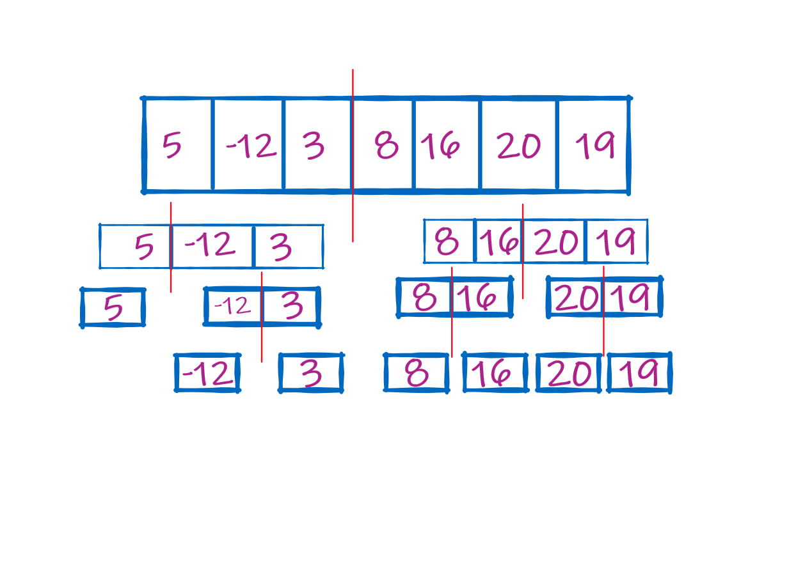
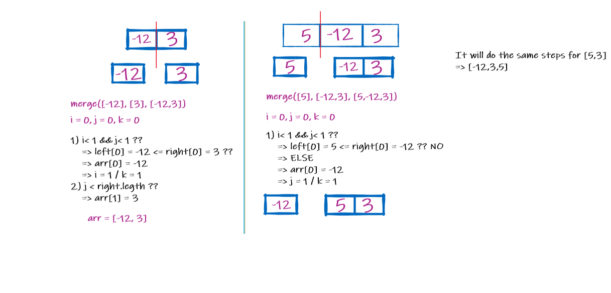
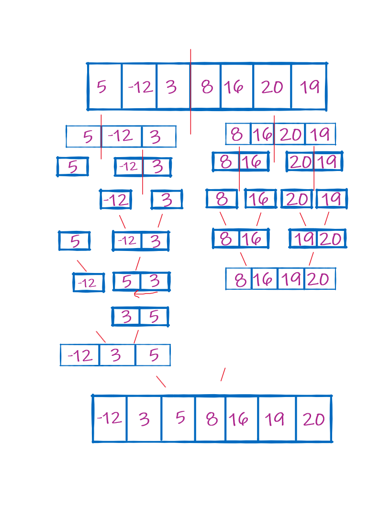

# Merge Sort 

Merge Sort is a Divide and Conquer algorithm. It divides the input array into two halves, calls itself for the two halves, and then merges the two sorted halves.

<br>
<hr>

**Pseudo Code**

```
ALGORITHM Mergesort(arr)
    DECLARE n <-- arr.length

    if n > 1
      DECLARE mid <-- n/2
      DECLARE left <-- arr[0...mid]
      DECLARE right <-- arr[mid...n]
      // sort the left side
      Mergesort(left)
      // sort the right side
      Mergesort(right)
      // merge the sorted left and right sides together
      Merge(left, right, arr)

ALGORITHM Merge(left, right, arr)
    DECLARE i <-- 0
    DECLARE j <-- 0
    DECLARE k <-- 0

    while i < left.length && j < right.length
        if left[i] <= right[j]
            arr[k] <-- left[i]
            i <-- i + 1
        else
            arr[k] <-- right[j]
            j <-- j + 1

        k <-- k + 1

    if i = left.length
       set remaining entries in arr to remaining values in right
    else
       set remaining entries in arr to remaining values in left

```


<br>
<hr>

**Sample Arrays:** [5,-12,3,8,16,20,19]



## Divide The Array : 

1- The array will be divided into two arrays at the midle to get two partions [left], [right]. 

2- The division process will continue until we get a single value in each partion.

> As you can see, we have [5] , [-12], [3], .... at the last step.





## Trace The Algorithm For Sorting : 

1- We start with the left part wich is [5], it is already single value and it has nothig on the right => That means it's ready to be merged.

2- Going to the right side, there is [-12], and [3] on the both left and right sides and the original array that holds both, [-12, 3]. 

3- In the first iteration : 

  1- i = 0 , j = 0 , k = 0  ..... [i is the left index, j is the right, and k is the original array's index].

  2- To enter the loop we check if both i and j less that 1 ? which is yes because we still at the first index = 0.

  3- Now we'll check, is the left[i] <= right[j] ?? ; left[i] = -12 & right[j] = 3.

  4- In that case we will set arr[0] to be equals to left[i] => arr[0] = -12 // Nothing changed because it's already sorted.

  5- No we well check the merge methd for the previos level => merge([5], [-12,3], [5,-12,3]).

  6- 1, 2, and 3 will be applied.

  7- For this step, we'll check if the left <= right ?? It's not because 3 > -12.

  8- Therefore, we'll go to the else statment to assign the arr[0] to be equals to right[0].

  9- We have [-12], [5,3] so far. 

  10- for the right partion, left is less than the right, we'll swap the values. 

  11- [-12], [3,5] => They're sorted and ready to merge. 

  12- [-12,3,5]. This for the first left partion of the original array. 

  13- We apply the same exact process for the rest of the partions.





Here is the final result after merging the sorted arrays together. 


## Efficency

 * Time: O(n*log(n)) => log(n) because of dealing with the halfs each time, 
        and the O(n*log(n)) because this process keeps happening n of times. 
 
 * Space: O(n) => The array takes n of the space which is indicates to its size.