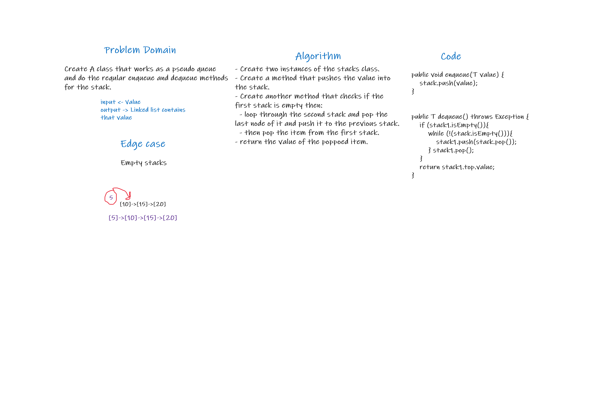

# Challenge Summary

- Create A class that works as a pseudo queue and do the reqular enqueue and dequeue methods for the stack.

## Whiteboard Process

## Approach & Efficiency
<!-- What approach did you take? Why? What is the Big O space/time for this approach? -->

## Solution

- utilize 2 Stack instances to create and manage the queue. 

- enqueue() => Inserts value into the PseudoQueue, using a first-in, first-out approach.

- dequeue() => Extracts a value from the PseudoQueue, using a first-in, first-out approach.

