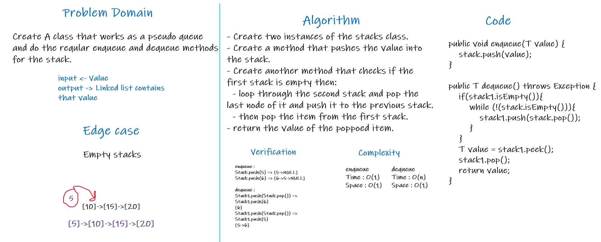
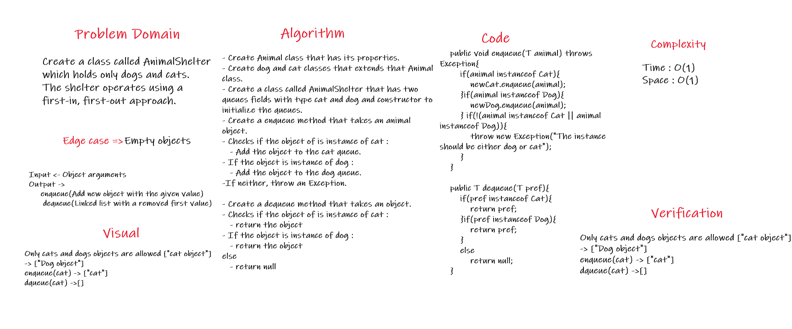

# Challenge Summary

- Create A class that works as a pseudo queue and do the reqular enqueue and dequeue methods for the stack.

## Whiteboard Process

- pseudoqueue =>

 

 

## Solution

- utilize 2 Stack instances to create and manage the queue. 

- enqueue() => Inserts value into the PseudoQueue, using a first-in, first-out approach.

- dequeue() => Extracts a value from the PseudoQueue, using a first-in, first-out approach.

 

- animal-shelter =>

## Approach & Efficiency
<!-- What approach did you take? Why? What is the Big O space/time for this approach? -->

 

## Solution

- Create a class called AnimalShelter which holds only dogs and cats.

- The shelter operates using a first-in, first-out approach.

- Implement the following methods:

   - enqueue

        - Arguments: animal
		
            - animal can be either a dog or a cat object.

   - dequeue

        - Arguments: pref

             - pref can be either "dog" or "cat"

        - Return: either a dog or a cat, based on preference.

             - If pref is not "dog" or "cat" then return null.

