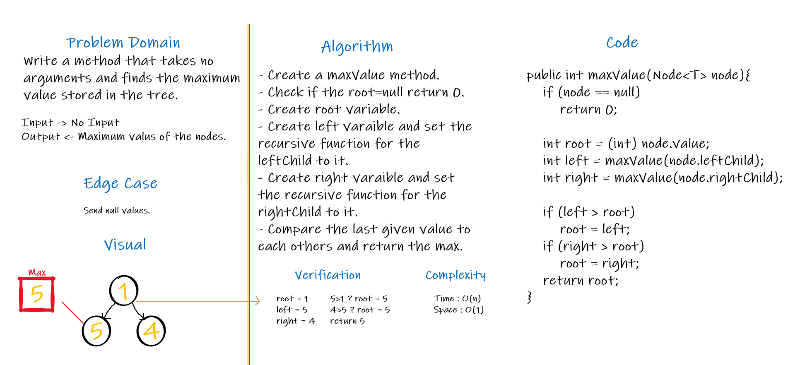

# Trees

A graph that contains a set of nodes, each node could abe a parent for one or more child node.

## Challenge
<!-- Description of the challenge -->

## Approach & Efficiency
<!-- What approach did you take? Why? What is the Big O space/time for this approach? -->

 
 

## API

### Binary Tree Class :

   

   - preOrder() => This method print the nodes `root >> left >> right`.

   - inOrder() =>This method print the nodes `left >> root >> right`.

   - postOrder() => This method print the nodes `left >> right >> root`.

    
   

    

   

   - maxValue() => This method returns the maximum value of the tree.

   

   - breadthFirstSearch(BinaryTree tree) => This method will take the tree as argument and returns a list of the tree's nodes level by level.

    

### Binary Search Tree Class : 

Create a Binary Search Tree class

   - This class should be a sub-class (or your languages equivalent) of the Binary Tree Class, with the following additional methods:
    Add
	
       - Arguments: value

       - Return: nothing

       - Adds a new node with that value in the correct location in the binary search tree.

   - Contains

       - Argument: value

       - Returns: boolean indicating whether or not the value is in the tree at least once.
